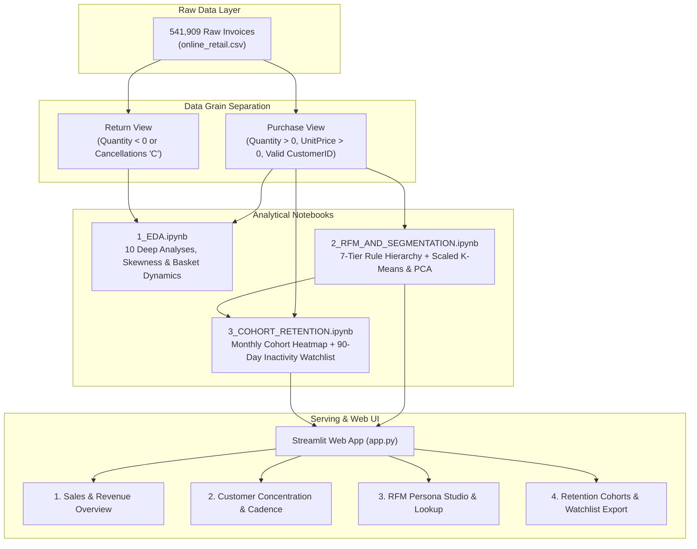

# 🛒 AI-Powered Retail Customer Intelligence & Retention Platform
> **End-to-End Data Science Project**: Exploratory Data Analysis, 7-Tier Hierarchical RFM Segmentation, Scaled K-Means Clustering, Monthly Cohort Retention Analysis & Interactive Streamlit Dashboard.

---

## 📌 Executive Summary
In e-commerce and retail businesses (like Amazon, Flipkart, or ASOS), customers do not sign explicit subscription contracts. Instead, they exhibit **non-contractual churn**—they simply stop ordering and drift to competitors. 

Acquiring a new customer costs **5x to 7x more** than retaining an existing one. This project implements a production-grade customer intelligence system that:
1. **Audits & Cleans 540,000+ Raw Transactions**: Distinguishes qualifying purchases from cancellations and returns across three analytical grains (Line Items $\rightarrow$ Orders $\rightarrow$ Customer Profiles).
2. **Executes 10 Deep Exploratory Analyses**: Uncovers wholesale buyer skew, peak operating hours (Wednesday/Thursday 11 AM - 1 PM), domestic vs international dynamics, and catalog Pareto inequalities.
3. **Implements a 7-Tier Hierarchical RFM Rule Engine**: Classifies 4,338 customer accounts into actionable behavioral personas (*Champions, Loyal Customers, At Risk Valuable, New Customers, Promising, Hibernating, Developing*).
4. **Validates via Unsupervised Machine Learning**: Compares rule personas against log-transformed, normalized **K-Means Clustering** ($k=4$) visualized via **2D Principal Component Analysis (PCA)**.
5. **Measures Longitudinal Customer Retention**: Builds a **Monthly Cohort Retention Heatmap** (Month 0 = 100%) and computes **Fixed-Window Second-Purchase Conversion Rates** (30, 60, 90 days) with eligible denominators.
6. **Deploys an Interactive Streamlit Dashboard**: Provides sales analytics, persona profiling, individual account lookups, and a 1-click **High-Value Inactivity Watchlist Export (CSV)** for CRM marketing outreach.

---

## 🏗️ System Architecture



---

## 💡 Key Analytical Discoveries

| # | Domain | Key Finding | Business Impact & Action |
|---|---|---|---|
| **1** | **Customer Concentration** | **Top 10% of customers generate 65.8% of revenue**; Top 1% generate **25.2%**. | Extreme VIP dependency. Dedicated VIP retention tier required. |
| **2** | **Repeat Purchase Rate** | Baseline repeat rate is **65.6%**; 34.4% buy only once. | Converting first-time buyers into second-purchase customers is the highest-leverage retention lever. |
| **3** | **Purchase Latency** | Median inter-purchase gap is **31 days**; 75% repeat within **72 days**. | Mathematically proves that **> 90 days of silence signifies an Inactive / Churned account**. |
| **4** | **Basket Economics** | Mean order is **£485**, but median is **£248**; 9% of orders exceed £1,000. | Heavy right skew caused by B2B wholesale buyers; requires non-parametric metrics. |
| **5** | **International AOV** | International AOV (£1,800–£2,400) is **5x UK AOV** (£420). | Overseas buyers consolidate orders to offset international freight and customs. |
| **6** | **Retention Cliff** | Cohort retention drops from 100% in Month 0 down to **18%–26% in Month 1**. | Critical early-life onboarding required within first 30 days. |

---

## 👑 The 7-Tier RFM Persona Hierarchy

Every customer is assigned from top-to-bottom using their Recency ($R$), Frequency ($F$), and Monetary ($M$) scores (1 to 5):

1. 🐣 **New Customers** ($F = 1$ and $R \ge 4$): Recent first-time buyers $\rightarrow$ *Action: 15% discount on 2nd purchase within 30 days*.
2. 🏆 **Champions** ($R \ge 4$ and $F \ge 4$ and $M \ge 4$): Highest spenders, most frequent, recently active $\rightarrow$ *Action: VIP concierge access, early catalog previews*.
3. 💎 **Loyal Customers** ($R \ge 3$ and $F \ge 4$): Steady, reliable repeat buyers $\rightarrow$ *Action: Category cross-sell bundles & restock alerts*.
4. ⚠️ **At Risk Valuable** ($R \le 2$ and [$F \ge 4$ or $M \ge 4$]): Past VIPs who went silent $\rightarrow$ *Action: Urgent personalized outreach & free shipping vouchers*.
5. 🌱 **Promising Customers** ($R \ge 4$): Recent shoppers with moderate spend $\rightarrow$ *Action: Category exploration recommendations*.
6. 💤 **Hibernating** ($R \le 2$): Low spenders inactive for a long time $\rightarrow$ *Action: Low-cost automated email reactivation*.
7. 📈 **Developing Customers**: All remaining middle-tier accounts $\rightarrow$ *Action: Standard promotional cadence*.

---

## 🚀 How to Run the Project Locally

### 1. Clone the Repository
```powershell
git clone <YOUR-GITHUB-REPO-URL>
cd customer_segmentation
```

### 2. Activate Virtual Environment
```powershell
.\venv\Scripts\Activate.ps1
```

### 3. Install Dependencies
```powershell
pip install -r requirements.txt
```

### 4. Launch the Interactive Streamlit Web App
```powershell
streamlit run app.py
```
*Your browser will automatically open to `http://localhost:8501` showcasing the full 4-page dashboard!*

---

## 📁 Repository Structure
```text
customer_segmentation/
│
├── artifacts/                           # Serialized model artifacts
│
├── notebook/                            # Research & Analytical Notebooks
│   ├── 1_EDA.ipynb                      # 10-part comprehensive exploratory analysis
│   ├── 2_RFM_AND_SEGMENTATION.ipynb     # 7-tier rule engine & scaled K-Means/PCA
│   ├── 3_COHORT_RETENTION.ipynb         # Monthly cohort heatmap & second-purchase conversion
│   └── data/                            # Raw and processed datasets (CSV)
│
├── src/                                 # Production Python Package
│   ├── __init__.py
│   ├── logger.py                        # Centralized timestamped logging
│   ├── exception.py                     # Custom traceback exception handling
│   ├── utils.py                         # Serialization helpers (dill)
│   ├── components/                      # Pipeline modules
│   └── pipeline/                        # Orchestration pipelines
│
├── app.py                               # 4-Page Interactive Streamlit Dashboard
├── requirements.txt                     # Pinned project dependencies
├── setup.py                             # Local package installer (-e .)
└── README.md                            # Project documentation
```
